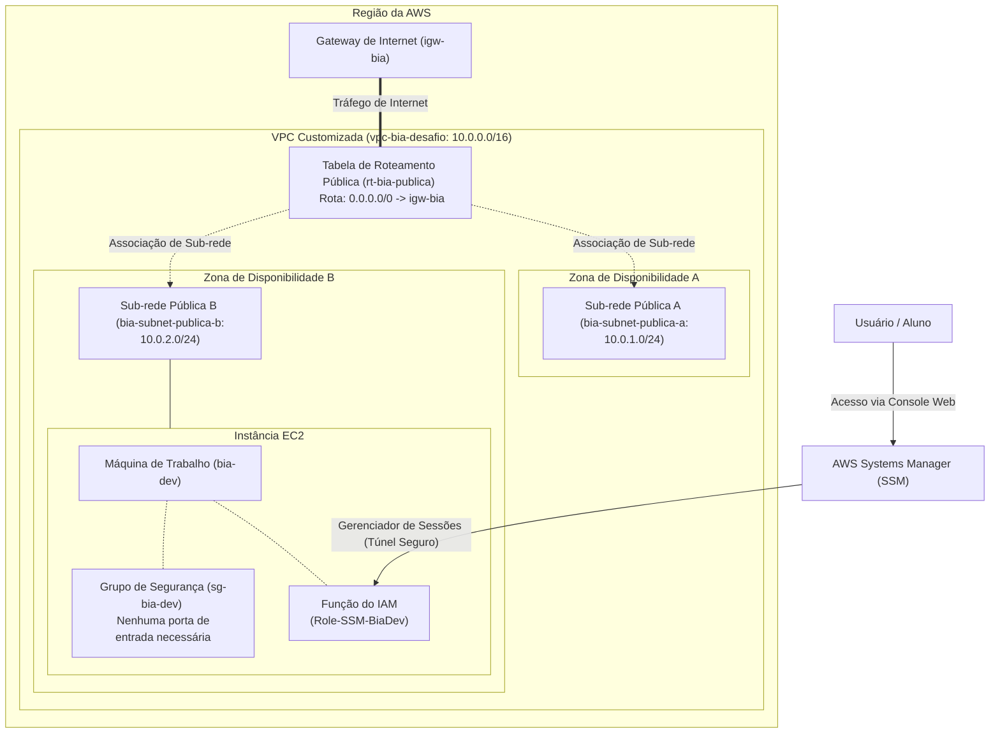

# Criação de VPC com acesso seguro via SSM

Este repositório documenta a execução de um desafio prático focado em arquitetura de redes e segurança na nuvem, desenvolvido durante a Mentoria Desafio Labs 2.0 (Formação AWS). O objetivo principal consistiu em abandonar as configurações padrão da AWS e projetar uma infraestrutura base totalmente customizada para a alocação da aplicação de laboratório `bia-dev`.

Para alcançar uma arquitetura robusta, a execução deste laboratório foi fundamentada em três pilares principais:

* **Isolamento e Controle de Rede (VPC):** Foi criada uma Nuvem Privada Virtual (VPC) customizada para garantir um ambiente logicamente isolado. O bloco de endereçamento da rede foi planejado e implementado manualmente.

* **Tolerância a Falhas e Alta Disponibilidade:** A rede foi segmentada em duas sub-redes públicas, estrategicamente distribuídas em duas Zonas de Disponibilidade distintas (Zona A e Zona B). Esta separação prepara o terreno para escalabilidade futura e balanceamento de carga. O lançamento da máquina de trabalho foi fixado especificamente na sub-rede da Zona B para validar o controle sobre a infraestrutura.

* **Segurança e Acesso Modernizado:** O acesso administrativo à instância EC2 foi implementado sem o uso de chaves criptográficas (`.pem`) e sem a necessidade de expor portas de entrada (como a porta 22 para SSH) no Grupo de Segurança. A comunicação bidirecional segura foi estabelecida através de funções do AWS Identity and Access Management (IAM) atreladas ao AWS Systems Manager (SSM).

O resultado é uma Prova de Conceito (PoC) que reflete as melhores práticas do mercado para alocação de recursos computacionais iniciais na nuvem.

# Diagrama de arquitetura

# Tecnologias utilizadas

- Amazon VPC (Criação de rede customizada, Sub-redes, Gateway de Internet e Tabelas de Roteamento)

- Amazon EC2 (Lançamento de máquina de trabalho)

- AWS Identity and Access Management - IAM (Criação de funções e políticas de segurança)

- AWS Systems Manager - SSM (Acesso remoto seguro a instâncias sem chaves criptográficas)
